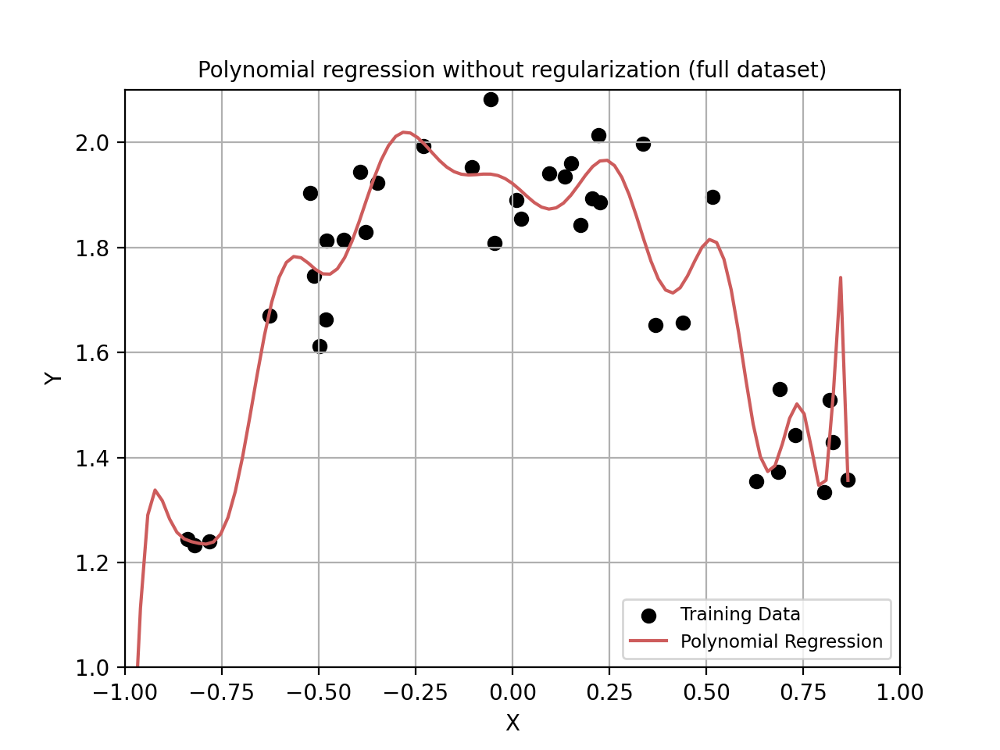
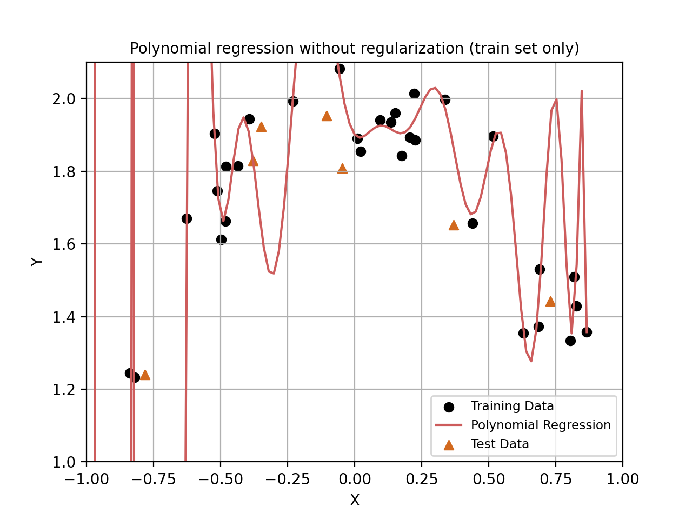
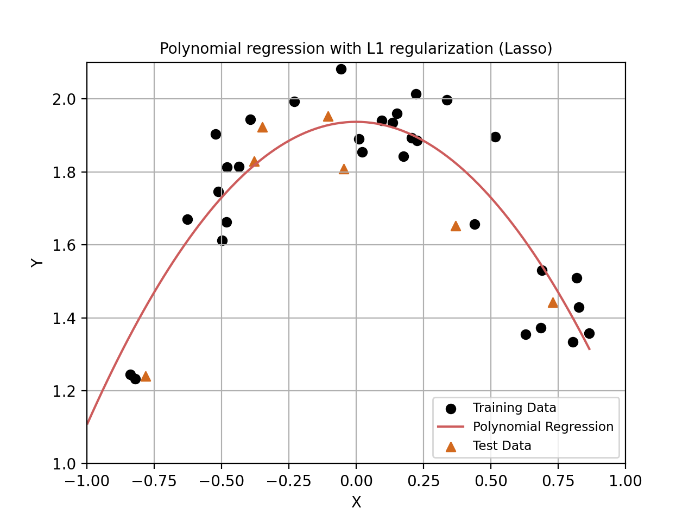
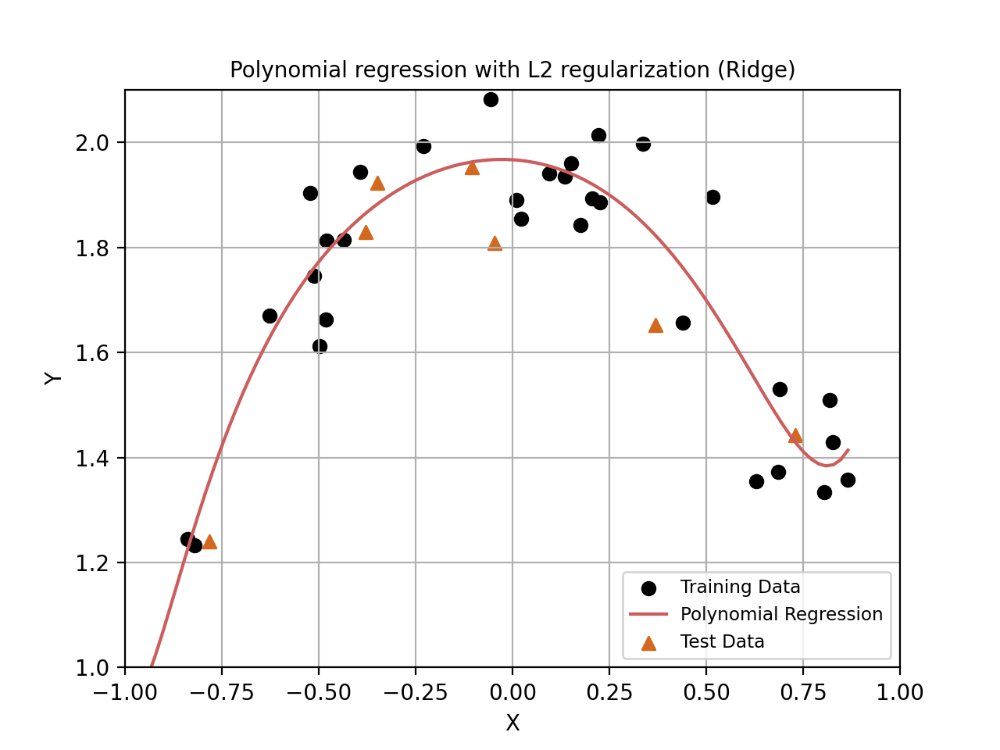
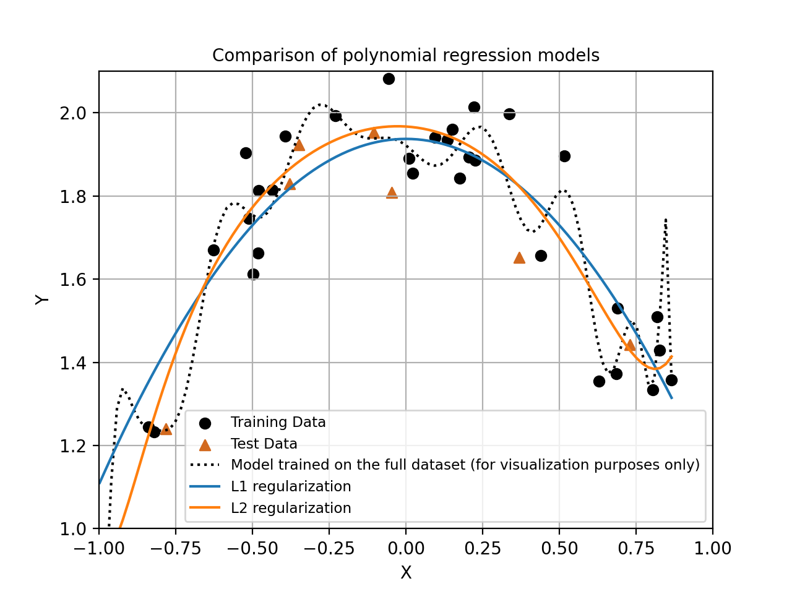

# Polynomial Regression and Regularization
### Polynomial Regression Without Regularization (Full Dataset)

The first model is trained on the entire dataset (for visualization purposes only) without any form of regularization.

### Dataset Split

The original dataset was randomly split into training and test subsets.

- Training set size: 32 samples  
- Test set size: 8 samples  

### Polynomial Regression Without Regularization (Train/Test Split)
The dataset is split into training and test subsets.
The same unregularized polynomial is fitted using only the training data.

### Polynomial Regression with L1 Regularization (Lasso)

L1 regularization is applied during training.

**Intercept:**
1.9373689727450651

**Coefficients:**
[ 0. -0.83079676 0. -0. 0. -0. 0. -0. 0. -0. 0. -0. 0. -0. 0. -0. 0. -0. 0. -0. ]

Most coefficients are exactly zero.
L1 regularization effectively removes higher-degree polynomial terms,
resulting in a much simpler model:

$$
\boxed{
y = 1.9374 - 0.8308 x^2
}
$$

### Polynomial Regression with L2 Regularization (Ridge)
L2 regularization penalizes large coefficients without forcing them to zero.
This leads to smoother curves while preserving all polynomial terms.

**Intercept:**
1.9671361086809414

**Coefficients:**
[-0.04542753 -0.82453981 -0.16978143 -0.43399264 0.13531673 0.07350288
0.30766892 0.21134133 0.27102186 0.19063908 0.16047161 0.13049321
0.05343988 0.07533308 -0.0248309 0.03657711 -0.07321622 0.0135393
-0.09836497 0.00221089]

All coefficients are retained, but their magnitudes are significantly reduced.
This leads to a smoother regression curve while preserving model flexibility:

$$
\boxed{
\begin{aligned}
y ={}& 1.9671 - 0.0454x - 0.8245x^2 - 0.1698x^3- 0.4340x^4 \\
&+ 0.1353x^5 + 0.0735x^6 + 0.3077x^7 + 0.2113x^8 \\
&+ 0.2710x^9 + 0.1906x^{10} + \dots
\end{aligned}
}
$$

### Overall Model Comparison

The final figure compares all polynomial regression curves:
without regularization, with L1 regularization, and with L2 regularization.

### Test Set Performance

The models were evaluated on the test set using the squared loss.

| Model                         | Test squared loss |
|------------------------------|-------------------|
| No regularization            | 1862.04           |
| L1 regularization (Lasso)    | 0.153             |
| L2 regularization (Ridge)    | 0.104             |

The unregularized model exhibits poor performance on the test set,
indicating severe overfitting.
