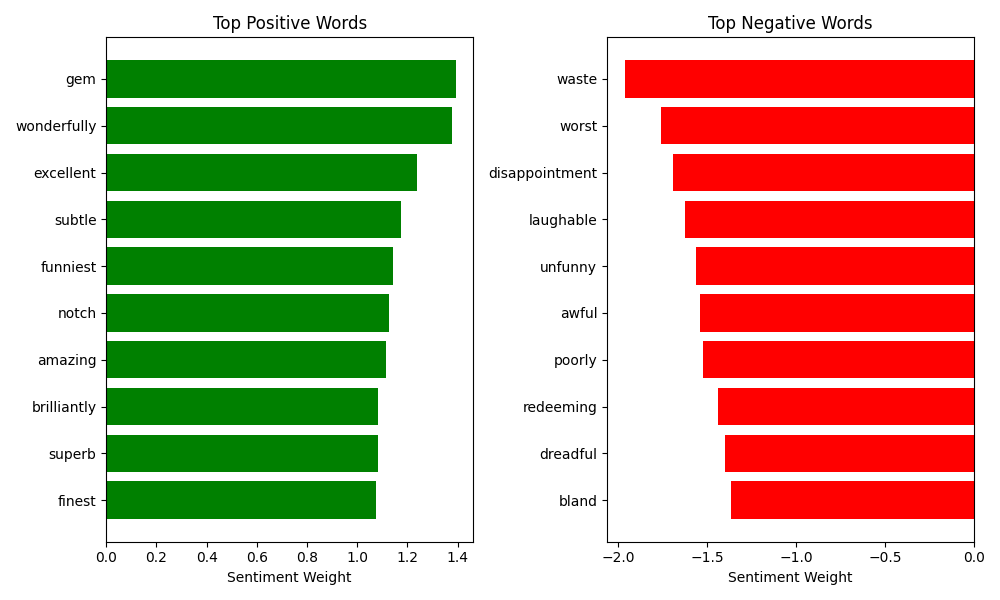

# Sentiment Analysis Report
This program studies existing labeled reviews from IMDb, finds patterns in the words people use, and visualizes which words have the strongest positive or negative influence.  
One limitation is that longer reviews may affect the final prediction more strongly.

The main feature is that user can enter their own movie review and instantly get a prediction of its sentiment, along with a confidence score.

Reviews are vectorized with the **Bag of Words** approach and classified using **Logistic Regression**.

---

## Data Head
| review | sentiment |
|--------|-----------|
| One of the other reviewers has mentioned that ... | 1 |
| A wonderful little production.   The... | 1 |
| I thought this was a wonderful way to spend ti... | 1 |
| Basically there's a family where a little boy ... | 0 |
| Petter Mattei's "Love in the Time of Money" is... | 1 |

---

## Data Count
| | |
|---|---|
| review       | 50000 |
| sentiment    | 50000 |

---

## Most Positive Words
| word        | weight    |
|-------------|-----------|
| gem         | 1.392863 |
| wonderfully | 1.376848 |
| excellent   | 1.237918 |
| subtle      | 1.173688 |
| funniest    | 1.142609 |
| notch       | 1.125417 |
| amazing     | 1.113996 |
| brilliantly | 1.084927 |
| superb      | 1.082453 |
| finest      | 1.074460 |

---

## Most Negative Words
| word           | weight     |
|----------------|------------|
| waste          | -1.962604  |
| worst          | -1.757228  |
| disappointment | -1.691127  |
| laughable      | -1.621469  |
| unfunny        | -1.560698  |
| awful          | -1.539282  |
| poorly         | -1.519996  |
| redeeming      | -1.437386  |
| dreadful       | -1.399609  |
| bland          | -1.364424  |

---

## Most Positive and Negative Words

---

## Most Positive Review
> By now you've probably heard a bit about the new Disney dub of Miyazaki's classic film, Laputa: Castle In The Sky. During late summer of 1998, Disney released "Kiki's Delivery Service" on video which included a preview of the Laputa dub saying it was...

---

## Most Negative Review
> Zombi 3 starts as a group of heavily armed men steal a experimental chemical developed to reanimate the dead, while trying to escape the man is shot at & the metal container holding the chemical is breached. The man gets some of the green chemical on...

---

## User Reviews
**Input:**  
> Wonderful movie, highly recommend it!

**Prediction:**  😊
> It's a positive review with a probability of **83.09%** 

**Input:**  
> The plot is boring, the acting is unconvincing, and the ending is completely disappointing.

**Prediction:**  😡
> It's a negative review with a probability of **93.68%** 

**Input:**  
> It's a piece of shit!

**Prediction:**  😡
> It's a negative review with a probability of **56.75%** 
